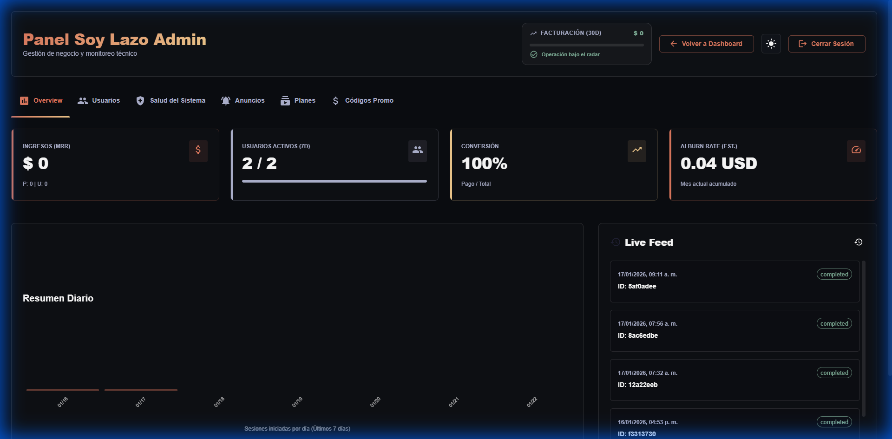
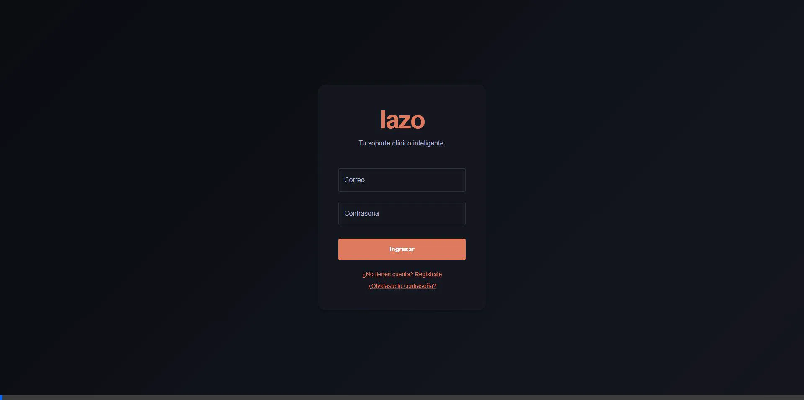

# Lazo

### Tu Copiloto Inteligente para Terapia

**Lazo** es la plataforma que revoluciona la práctica clínica de psicólogos y terapeutas. Diseñamos una herramienta que te permite dejar de preocuparte por las notas y enfocarte 100% en tus pacientes.

Mediante **Inteligencia Artificial de última generación**, Lazo escucha (si tú lo deseas), transcribe y analiza tus sesiones para generar automáticamente toda tu documentación clínica en segundos.

---

## Interfaz Intuitiva

Lazo cuenta con una interfaz moderna y adaptable (Modo Claro / Oscuro) diseñada para reducir la fatiga visual.

---

## ¿Por qué Lazo?

La carga administrativa es la parte más tediosa de la terapia. Lazo elimina ese peso de tus hombros:

- **Recupera tu tiempo**: Ahorra horas de escritura manual cada semana.
- **Mejora tu atención**: Mantén el contacto visual y la escucha activa sin distraerte tomando apuntes.
- **Documentación impecable**: Obtén notas estructuradas (SOAP, DAP) y análisis detallados sin esfuerzo.

---

## Lo que Lazo hace por ti

### Transcripción y Análisis Automático

Graba tus sesiones de forma segura y deja que nuestra IA las convierta en texto y extraiga lo importante.

- **Notas Clínicas**: Generación automática de formatos SOAP, DAP y resúmenes ejecutivos.
- **Análisis de Sentimiento**: Entiende la evolución emocional de tus pacientes sesión a sesión.
- **Detección de Riesgos**: Alertas automáticas sobre indicadores clínicos importantes detectados en el discurso.

### Gestión Integral de Pacientes

Tu consultorio digital en un solo lugar.

- **Perfiles Completos**: Historial, datos de contacto y notas anteriores accesibles al instante.
- **Organización de Sesiones**: Mantén un registro ordenado y consultable de cada encuentro.

### Privacidad y Seguridad Primero

Entendemos la confidencialidad de tu profesión.

- **Encriptación de Grado Militar**: Los datos de tus pacientes son tuyos y de nadie más.
- **Protección Total**: Protocolos de seguridad avanzados para garantizar el secreto profesional.

---

## Ideal para...

- **Psicólogos Clínicos** que buscan modernizar su práctica.
- **Psiquiatras y Terapeutas** que necesitan optimizar su tiempo.
- **Clínicas de Salud Mental** que desean estandarizar y mejorar sus registros.

---

> _"Menos burocracia, más terapia. Deja que Lazo se encargue del papeleo."_

---

**Lazo Team** - Tecnología al servicio de la Salud Mental
